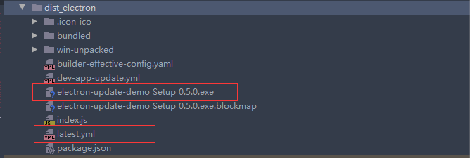
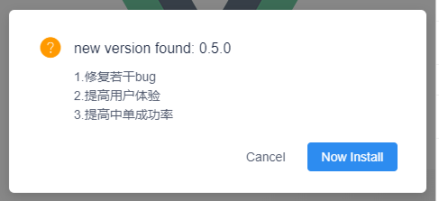

# electron-update-demo

## Project setup
```
yarn install
```

### 开发环境运行
```
yarn electron:serve
```

如果要进行客户端更新测试，把跟目录中的 `dev-app-update.yml` 手动复制到 `dist_electron` 目录下，如果没有就手动创建

`dev-app-update.yml` 中的内容如下：
```yaml
provider: generic
url: ''
updaterCacheDirName: $项目名称$
```

### 编译打包更新程序
把 `package.json` 中的 `version` 版本号提高，执行下面的命令
```
yarn electron:build
```
然后把生成好的两个文件上传到自己的文件服务器中：



`latest.yml` 内容如下
```yaml
version: 0.5.0
files:
  - url: electron-update-demo Setup 0.5.0.exe
    sha512: Nk9kgWg546yGqGiHOy5opK1+y4OxwPterJTyR9SemkLZzSYn+DaxC19ktwPAdDyZ30BQA222OlNjLJ3oN95PFA==
    size: 50977966
path: electron-update-demo Setup 0.5.0.exe
sha512: Nk9kgWg546yGqGiHOy5opK1+y4OxwPterJTyR9SemkLZzSYn+DaxC19ktwPAdDyZ30BQA222OlNjLJ3oN95PFA==
releaseDate: '2020-07-28T07:35:37.149Z'
```
可以加一些自定义的内容, 如更新说明：
```yaml
version: 0.5.0
files:
  - url: electron-update-demo Setup 0.5.0.exe
    sha512: Nk9kgWg546yGqGiHOy5opK1+y4OxwPterJTyR9SemkLZzSYn+DaxC19ktwPAdDyZ30BQA222OlNjLJ3oN95PFA==
    size: 50977966
path: electron-update-demo Setup 0.5.0.exe
sha512: Nk9kgWg546yGqGiHOy5opK1+y4OxwPterJTyR9SemkLZzSYn+DaxC19ktwPAdDyZ30BQA222OlNjLJ3oN95PFA==
releaseDate: '2020-07-28T07:35:37.149Z'
remarks:
  - 1.修复若干bug
  - 2.提高用户体验
  - 3.提高中单成功率
```

可以通过检测更新的回调函数读取到自定义的内容：
```js
      ipcRenderer.on('isUpdateNow', (event, versionInfo) => {
        vm.message = versionInfo.remarks;
        // 自定义选择效果，效果自行编写
        let content = "";
        if (versionInfo.remarks) {
          for (let remark of versionInfo.remarks) {
            content += `<p>${remark}</p>`
          }
        }

        vm.$Modal.confirm({
          title: 'new version found: ' + versionInfo.version,
          content: content,
          okText: 'Now Install',
          cancelText: 'Cancel',
          onOk() {
            console.log('开始更新')
            ipcRenderer.send('updateNow')
          },
          onCancel(tx) {
          },
        });
      })
```


详细更新过程在 `HelloWorld.vue` 和 `updater.js` 中

### Customize configuration
See [Configuration Reference](https://cli.vuejs.org/config/).
